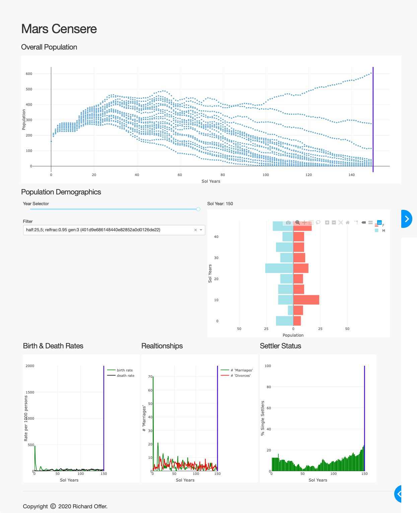

Mars Censere
============

This project is aimed at building a robust population model for humanity on Mars.

The name comes from the Latin for "census", since it is simulating a population at the (named) individual level, rather than the macro level.

This is a work in progress, the models are still being developed, but for an (old) graphical view of the sort of data we are producing take a look look at [docs/dashboard.png](docs/dashboard.png)


Getting Involved
================

The idea for the project came out of a series of presentations at the European Mars Conference in 2019, where papers were discussing city designs for 1000 people on Mars. But no mention during the presentations of how the population would get to that number.

The novel thing about this is that we are simulating individuals, it tracks family lines so we can limit close genetic mixing. The intent being to allow extending into economic models later (resource requirements, family wealth, wealth distribution etc).

It is also a numerical simulation - its expected that a large number of simulations will be run ("wisdom of the masses") rather than anointing a specific set of calculation factors as "correct"


Quick Start
===========

This was developed using Python 3.8+. It will probably work on earlier versions of Python 3. Not interested in supporting Python 2 at this point.

There are expected to be multiple components in the project, currently
we are separating the simulation run from any downstream analsis to allow simulation to run in parallel on large machines.
The simulation run (`generator`) outputs into a SQLite database,
which can be loaded into `pandas`, `R` etc) as desired.

The database can hold multiple simulations so you can analyse the
impact of changing the simulation model.


Basic Usage
-----------

```
mars-censere
Usage: mars-censere [OPTIONS] COMMAND [ARGS]...

Options:
  --help  Show this message and exit.

COMMANDS:
   dashboard - Interactive UI for viewing simulation results
   generator - Generate simulation data
       merge - Merge results from separate databases

For additional help on a command use

    `censere <CMD> --help`
or
    `censere <CMD> --hints`
```

```
mars-censere --help
Usage: mars-censere [OPTIONS] COMMAND [ARGS]...

Options:
  -v, --verbose INTEGER     Set system-wide verbosity
  --debug                   Run in development mode (additional logging)
  --log-level LOGGER=LEVEL  Override logging level for given logger
  --database PATH           Path to database (CENSERE_DATABASE)
  --dump                    Dump the simulation parameters to stdout
                            (CENSERE_DUMP)
  --debug-sql               Enable debug mode for SQL queries
                            (CENSERE_DEBUG_SQL)
  --help                    Show this message and exit.
```

```
mars-censere generator --help
Usage: mars-censere generator [OPTIONS]

  Generate simulation data

Options:
  --random-seed RAND              Seed used to initialize random engine
                                  (CENSERE_GENERATOR_SEED)
  --continue-simulation ID        Continue simulation ID to a new limit
                                  (CENSERE_GENERATOR_CONTINUE_SIMULATION)
  --notes TEXT                    Add TEXT into notes column in simulations
                                  table (CENSERE_GENERATOR_NOTES)
  --database-dir DIR              Use a unique file in DIR. This takes
                                  priority over --database. Unique file is
                                  based on the simulation id
                                  (CENSERE_GENERATOR_DATABASE_DIR)
  --astronaut-age-range RANDOM    Age range (years) of arriving astronauts
                                  (CENSERE_GENERATOR_ASTRONAUT_AGE_RANGE)
  --astronaut-gender-ratio MALE,FEMALE
                                  Male:Female ratio for astronauts, MUST add
                                  up to 100
                                  (CENSERE_GENERATOR_ASTRONAUT_GENDER_RATIO)
  --astronaut-life-expectancy RANDOM
                                  Life expectancy of arriving astronauts (CENS
                                  ERE_GENERATOR_ASTRONAUT_LIFE_EXPECTANCY)
  --common-ancestor GENERATION    Allow realtionships where common ancestor is
                                  older than GEN. GEN=1 => parent, GEN=2 =>
                                  grandparent etc
                                  (CENSERE_GENERATOR_COMMON_ANCESTOR)
  --first-child-delay RANDOM      'Delay (sols) between relationship start and
                                  first child
                                  (CENSERE_GENERATOR_FIRST_CHILD_DELAY)
  --fraction-singles-pairing-per-day FRACTION
                                  The fraction of singles that will start a
                                  relationship PER DAY
                                  (CENSERE_GENERATOR_FRACTION_SINGLES_PAIRING)
  --fraction-relationships-having-children FRACTION
                                  The fraction of relationships that will have
                                  children (CENSERE_GENERATOR_FRACTION_RELATIO
                                  NSHIPS_HAVING_CHILDREN)
  --martian-gender-ratio MALE,FEMALE
                                  Male:Female ratio for new born martians,
                                  MUST add up to 100
                                  (CENSERE_GENERATIOR_MARTIAN_GENDER_RATIO)
  --martian-life-expectancy RANDOM
                                  Life expectancy of new born martians
                                  (CENSERE_GENERATOR_MARTIAN_LIFE_EXPECTANCY)
  --orientation HETROSEXUAL,HOMOSEXUAL,BISEXUAL
                                  Sexual orientation percentages, MUST add up
                                  to 100 (CENSERE_GENERATOR_OREINTATION)
  --partner-max-age-difference YEARS
                                  Limit possible relationships to partners
                                  with maximum age difference (CENSERE_GENERAT
                                  OR_PARTNER_MAX_AGE_DIFFERENCE)
  --relationship-length RANDOM    How many SOLS a relationship lasts
                                  (CENSERE_GENERATOR_RELATIONSHIP_LENGTH)
  --sols-between-siblings RANDOM  Gap between sibling births
                                  (CENSERE_GENERATOR_SOLS_BETWEEN_SIBLINGS)
  --use-ivf                       Use IFV to extend fertility
                                  (CENSERE_GENERATOR_USE_IFV)
  --initial-mission-lands DATETIME
                                  Earth date that initial mission lands on
                                  Mars
                                  (CENSERE_GENERATOR_INITIAL_MISSION_LANDS)
  --limit [sols|population]       End simulation when we hit a time or
                                  population limit (CENSERE_GENERATOR_LIMIT)
  --limit-count INTEGER           Stop simulation when reaching this
                                  sols/population count
                                  (CENSERE_GENERATOR_LIMIT_COUNT)
  --mission-lands RANDOM          Land a new mission every RANDOM sols
                                  (CENSERE_GENERATOR_MISSION_LANDS)
  --initial-settlers-per-ship RANDOM
                                  Number of arriving astronauts (per ship) for
                                  the initial mission (CENSERE_GENERATOR_INITI
                                  AL_SETTLERS_PER_SHIP)
  --initial-ships-per-mission RANDOM
                                  Number of ships for the initial mission (CEN
                                  SERE_GENERATOR_INITIAL_SHIPS_PER_MISSION)
  --settlers-per-ship RANDOM      Number of arriving astronauts (per ship) for
                                  subsequent missions
                                  (CENSERE_GENERATOR_SETTLERS_PER_SHIP)
  --ships-per-mission RANDOM      Number of ships for subsequent missions
                                  (CENSERE_GENERATOR_SHIPS_PER_MISSION)
  --cache-details                 Log cache effectiveness as the simulation
                                  runs (CENSERE_GENERATOR_CACHE_DETAILS)
  --hints                         Print additional help
  --help                          Show this message and exit.
```

```
mars-censere generator --hints


The Database should be on a local disk - not in Dropbox etc.

RANDOM Values
=============

This can be calculated using built-in tables from the CDC, or a random function

The option is specified as string:arg1,arg2,..argn

Acceptable Values are:

  cdc:
    use CDC tables (no args are needed). This is only valid for Life Expectancy

  triangular:MIN,PEAK,MAX
    use NUMPY's triangular random function with MIN,PEAK and MAX ages (in earth years)

  guass:MEAN,STDDEV
    use NUMPY's guass random function with MEAN and STDDEV ages (in earth years)

  randint:MIN,MAX
    use NUMPY's randint random function with MIN and MAX ages such that
    MIN <= N <= MAX (in earth years)

  randrange:MIN,MAX
    use NUMPY's randint random function with MIN and MAX ages such that
    MIN <= N < MAX (in earth years)

  half:BEGIN,STEP
    There is a 50% probability that a value between BEGIN and BEGIN+STEP
    will be picked, 25% between BEGIN+STEP and BEGIN+(STEP*2), a 12.5%
    between BEGIN+(STEP*2) and BEGIN+(STEP*3) etc.

```


Censere will read values from the environment as listed in the help
text (i.e. the database can be set using the environment variable
CENSERE_DATABASE)


Then run the `generator` to run the simulation - a small run to start off.

```
% mars-censere generator --limit-count=100
2019-11-21T11:26:07 NOTICE Mars Censere 2019.325
2019-11-21T11:26:07 NOTICE 1.1 (1) Simulation eff6acc5-a6a8-4cdb-9a37-b9f133078560 Started. Goal population = 100
2019-11-21T11:26:07 NOTICE 1.1 Mission landed with 20 colonists
2019-11-21T11:26:07 NOTICE 1.28 (28) #Colonists 20
2019-11-21T11:26:07 NOTICE 1.56 (56) #Colonists 20
2019-11-21T11:26:07 NOTICE 1.63 Martian Jesse Johnson (d8d54575-b4c0-4fab-8a92-35c2455f02d0) born
2019-11-21T11:26:07 NOTICE 1.84 (84) #Colonists 21
2019-11-21T11:26:07 NOTICE 1.106 Martian Brenda White (2717a34f-aa95-4809-8ad1-9fb2f0fc6025) born
2019-11-21T11:26:07 NOTICE 1.112 (112) #Colonists 22
2019-11-21T11:26:07 NOTICE 1.140 (140) #Colonists 22
...
2019-11-21T11:26:10 NOTICE 2.588 (1256) #Colonists 90
2019-11-21T11:26:10 NOTICE 2.616 (1284) #Colonists 90
2019-11-21T11:26:10 NOTICE 2.630 Martian Joshua Gray (73b83747-5883-499d-b7df-9b5bb291c495) born
2019-11-21T11:26:10 NOTICE 2.644 (1312) #Colonists 91
2019-11-21T11:26:10 NOTICE 3.0 (1336) #Colonists 91
2019-11-21T11:26:10 NOTICE 3.28 (1364) #Colonists 91
2019-11-21T11:26:10 NOTICE 3.56 (1392) #Colonists 91
2019-11-21T11:26:10 NOTICE 3.84 (1420) #Colonists 91
2019-11-21T11:26:11 NOTICE 3.112 (1448) #Colonists 91
2019-11-21T11:26:11 NOTICE 3.140 (1476) #Colonists 91
2019-11-21T11:26:11 NOTICE 3.168 (1504) #Colonists 91
2019-11-21T11:26:11 NOTICE 3.183 Mission landed with 69 colonists
2019-11-21T11:26:11 NOTICE 3.184 (1520) Simulation eff6acc5-a6a8-4cdb-9a37-b9f133078560 Complete. population 160 >= 100
```

Building
========

It can be simply installed into a Python virtual env.

```
% pip3 install --upgrade build
% pip install .
```

Using Docker
------------

There is a script `scripts/build.sh` that will build a docker image

SQLite is not intended for parallel use, best practice is to mount
a directory into the container and then specify a run specific
database i.e.

```
docker run -it -d -v $(pwd)/sims/:/data  $image --database-dir=/data/
```

Then merge all the individual simulations into a single database for
reporting/analysis  (`mars-censere merge sims/*.db`) 


Post-simulation Analysis
========================

There is an early version of an interactive graphical dashboard in
`censere/cmds/dashboard.py` - it reads from a previously generated database.

```
% mars-censere --database sims/202002021525.db dashboard
```



The analysis of simulations is currently a WIP, currently the plan is to 
move to using Jupyter (python) rather than the initial R-based notebooks.
